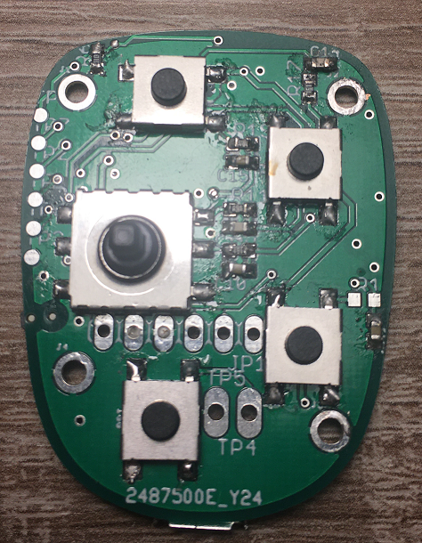
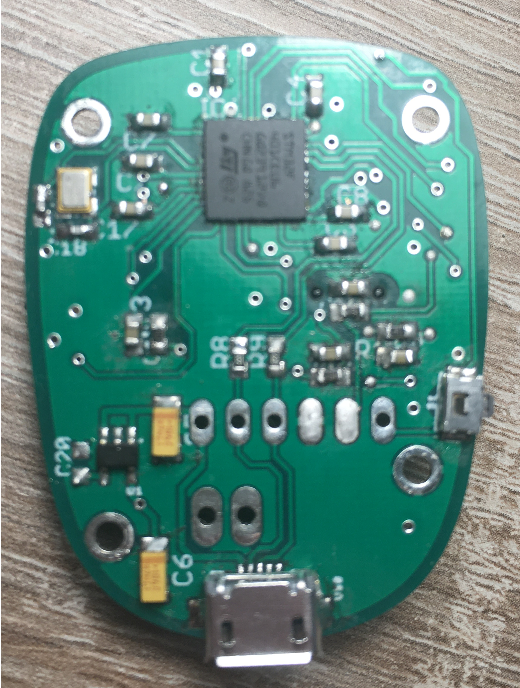

# remote-stick

Software is for a remote control stick for a glider. You can use it for your OpenVario system. The interface is USB. The software is based on the mebd RTOS.

MCU: STM32F401CE

Top:

Buttom:

Build command: mbed-tools compile --custom-targets-json remote-stick.json -m REMOTE-STICK -t GCC_ARM